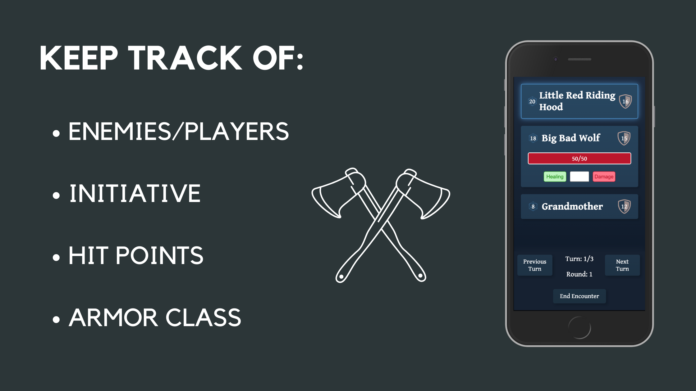

# 

## <code>Description</code>

### An app to help Game Masters run encounters in their DnD Games smoothly

Apart from storytelling and roleplay, an integral part of Dungeons and Dragons is combat. Combat encounters can range from small fights that only last a few minutes to intense battles that last for multiple hours. As a Game Master it is your task to manage those encounters. The Encounter Tracker is an app designed to help with that by keeping track of every important statistic for you, so you can keep a clear head and focus on having fun.

# 

### <code>Demo</code>

A hosted version can be found here:
[Encounter Tracker Demo](https://encounter-tracker.vercel.app/)

## <code>Tech Stack</code>

- React
- React Router
- React Hooks
- Styled Components
- Storybook
- Cypress
- Jest
- React Testing Library
- Vercel

## <code>Project setup</code>

<ol>
<li>Clone this repository</li>
<li>Install all npm dependencies:
<code>npm install</code>
</li>
<li>To run the app in development mode run <code>npm start</code>, then open http://localhost:3000 to view it in the browser</li>
<li>To run Storybook use <code>npm run storybook</code></li>
<li>To run unit tests use <code>npm test</code></li>
<li>To run Cypress tests use <code>npm run cypress</code></li>
<li>To create a build ready for deployment use <code>npm run build</code></li>
</ol>
